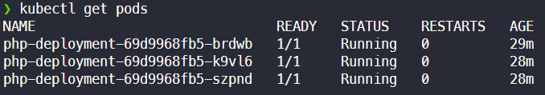
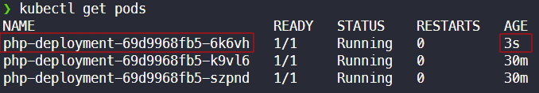

# Projeto de Alta Disponibilidade com Docker e Kubernetes

Este repositório contém as instruções e recursos necessários para desenvolver um cluster de alta disponibilidade utilizando Docker e Kubernetes. A alta disponibilidade é essencial para garantir que seus aplicativos ou serviços estejam sempre acessíveis, mesmo em caso de falhas de hardware ou software.

## Pré-requisitos

- 
- 
- 
- 

## Instruções de Configuração

1. Instale o [Kind (Kubernetes in Docker)](https://kind.sigs.k8s.io/):
   ```sh
   go install sigs.k8s.io/kind@v0.20.0
   ```

2. Crie um cluster Kind chamado "high-availability":
   ```sh
   kind create cluster --name=high-availability
   ```

3. Ative o cluster criado e verifique as informações do cluster:
   ```sh
   kubectl cluster-info --context kind-high-availability
   ```

4. Implante os pods utilizando o arquivo de configuração `deployment.yaml`:
   ```sh
   kubectl apply -f deployment.yaml
   ```

5. Verifique se os pods foram criados corretamente:
   ```sh
   kubectl get pods
   ```

6. Estabeleça a conexão de portas para acessar a aplicação pelo Kubernetes:
   ```sh
   kubectl port-forward deployment/php-deployment 8888:80
   ```

Agora você pode acessar a aplicação através da porta 8888 usando o endereço http://127.0.0.1:8888.

## Alta Disponibilidade em Ação

Para verificar os pods em execução, utilize o comando:
```sh
kubectl get pods
```



Para testar a alta disponibilidade, exclua um dos pods usando o comando:
```sh
kubectl delete pod <nome-do-pod>
```



Observe que o pod excluído foi automaticamente recriado e sua idade atualizada. Isso demonstra o conceito de alta disponibilidade, onde três réplicas da aplicação garantem sua eficiência e confiabilidade mesmo em caso de falhas.

Por favor, note que para ver isso em tempo real em um ambiente de produção, seria necessário um serviço de nuvem. No entanto, este projeto é fundamental para compreender os princípios da alta disponibilidade em Kubernetes.